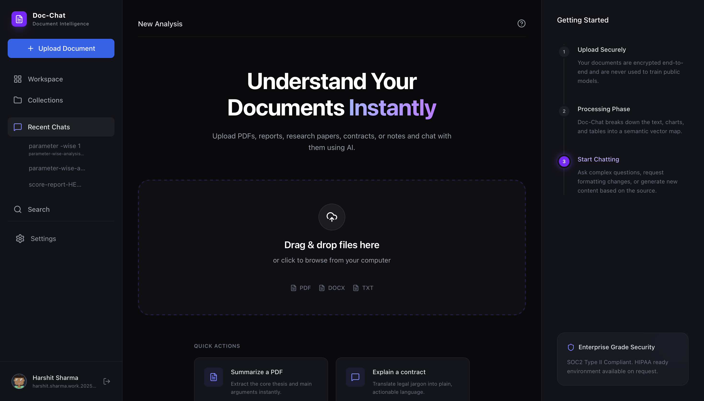

# Doc-Chat

**[Live Demo 🚀](https://doc-chat-frontend.vercel.app)**

**Doc-Chat** is an intelligent, document-centric application that empowers users to seamlessly interact with their personal or business documents using AI. 

Built on the principles of **Retrieval-Augmented Generation (RAG)**, Doc-Chat ensures that every answer provided by the AI is strictly grounded in the content of your uploaded files. Rather than hallucinating facts from its training data, Doc-Chat extracts relevant passages, cites its sources, and explicitly tells you when information is simply "not covered" in your documents.

Whether you are analyzing a massive technical specification, scanning legal contracts, or studying lengthy reports, Doc-Chat transforms static files into dynamic, conversational knowledge bases.

---

## The Problem

Asking a generic AI chatbot about your own documents doesn't work — it either has no idea what's in them, or it confidently makes something up. Doc-Chat solves this with retrieval-augmented generation (RAG): it only answers from what's actually in your uploaded documents, and says so when it can't find the answer.

## What it does

- Upload a PDF, DOCX, or TXT document (max 10MB)
- Ask questions in plain English
- Get answers grounded in the document, with the source page/excerpt cited
- If the answer isn't in the document, it tells you — instead of guessing
- Seamlessly manage your document collections and history

### Screenshots




## How it works

*(architecture diagram here)*

1. Documents are split into overlapping chunks (~500 tokens) and converted into embeddings via Gemini's embedding model.
2. Embeddings (numerical representations of meaning) are stored in Postgres via the `pgvector` extension.
3. A user's question is embedded the same way and matched against the closest chunks using cosine similarity search.
4. Only those matched chunks are sent to the model, with an explicit instruction to answer only from them.
5. If no chunk clears a similarity threshold, the app skips the model call entirely and returns "not covered" directly — this is our main defense against hallucination.

## Tech stack

| Layer | Choice | Why |
|---|---|---|
| Frontend | React + TanStack Query + Tailwind | Modern, reactive UI with robust state management and premium design aesthetics |
| Backend | Node.js + Express | Fast, scalable API (See [Doc-Chat Backend Repo](https://github.com/harshitsharma7017/Doc-Chat_backend.git)) |
| Database | PostgreSQL + `pgvector` | Vector search alongside relational document/chunk data |
| Embeddings | Google Gemini API | Free tier, 1M token context (`gemini-embedding-001` & `gemini-2.5-flash`) |
| Deployment | Vercel (Frontend) | Easy, scalable deployment for SPAs |

## Metrics

*(fill in after load testing / real usage)*

- Documents processed without ingestion failure: X/Y
- P95 retrieval + generation latency: Xms
- Manual grounding accuracy check: X/Y test questions correctly answered or correctly declined

## Running locally

This repository contains the frontend application. **You will also need to run the backend server for the app to function properly.**

### 1. Setup Backend
Please follow the instructions in the [Doc-Chat Backend Repository](https://github.com/harshitsharma7017/Doc-Chat_backend.git) to get the API running locally on `localhost:3000`.

### 2. Setup Frontend

```bash
git clone <repo-url>
cd Doc-Chat/frontend

npm install
cp .env.example .env   # Add VITE_BACKEND_URL (e.g., http://localhost:3000/api)
npm run dev
```

The frontend will run on `localhost:5173`.

## What I'd add next (v2)

- OCR support for scanned/image-only PDFs
- Multi-document cross-referencing ("compare what document A and B say about X")
- Configurable model provider (OpenAI/Claude as alternatives to Gemini)

---

*Built by Harshit Sharma — [portfolio](https://harshitfolio.vercel.app) · [LinkedIn](https://www.linkedin.com/in/harshit-sharma-backend-developer)*
